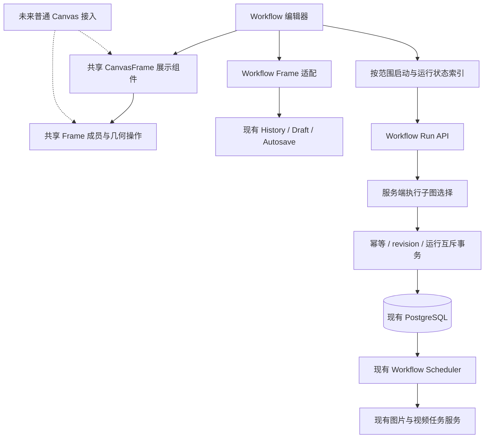

# Workflow Frame 架构与实施方案

> 执行说明：按 `superpowers:executing-plans` 逐项实施；需要委派时遵循当时有效的用户授权。步骤复用当前仓库的测试方式，不引入新的工作流引擎。

**目标：** 在同一 Workflow 中创建可命名、可移动、可调整大小的 Frame，按 Frame 独立运行流程，同时提供普通 Canvas 可复用的分组能力。

**架构：** 共享 Frame 只负责展示和分组交互；Workflow 负责成员适配、执行范围、运行快照及结果归属。后端从已保存定义中构建执行子图，继续使用现有调度器、生成服务和媒体引用事务。

**技术栈：** 当前 infinite-canvas 的 React 19、Next.js 16、TypeScript、Bun、Ant Design、Go、GORM、PostgreSQL。本文不采用门户 ssoportal 的 Fastify/Vite 实现方式。

**设计依据：** 本文第 1—10 节为架构规格，第 11—13 节为实施与验收方案。

**日期与状态：** 2026-09-11 的初始方案，本地实施完成且未提交或上线。本文记录的 Shift+J / Shift+P 已在 2026-09-12 被“普通拖入自动加入、Alt 拖出”取代；当前行为以 [操作说明](../../workflow-operations.md) 和 [交互适配记录](../../workflow-frame-interaction-adaptation.md) 为准。基线 `9bd8f3b`，实际验证与工具限制见 [实施记录](../../workflow-frames-implementation-report.md)。

## 全局约束

- 一个节点最多属于一个 Frame；第一版禁止 Frame 嵌套。
- 删除 Frame 保留全部成员节点及连线，只解除成员关系，不取消运行。
- 允许引用框外图片、视频和文本输入；单框运行禁止依赖框外生成步骤。
- 框内输出可以连接到框外生成节点，但单框运行停在边界，框外节点不执行。
- 不同 Frame 可以独立运行；同一 Frame 在运行结束前不能重复启动。
- 调度继续遵守现有全局和单次运行并发上限，不增加供应商吞吐或无限并发承诺。
- 快捷键按用户指定提供 `Shift+J` 加入、`Shift+P` 移出，并提供菜单入口。
- 保留现有保存 revision、草稿、租约、媒体校验和清理协议；运行范围扩展所需的请求及数据库字段在本文明确列出。
- 本次只为 Workflow 接入 Frame。普通 Canvas 复用基础能力的接口先确定，普通 Canvas 的保存文档和界面接入另做专项。
- 实施与验证使用本地或独立测试环境，不调用收费生成，不自动提交、推送、部署或重建 Docker。

## 1. 已确认需求与补充设计

### 1.1 已确认的业务规则

| 项目 | 行为 |
| --- | --- |
| Frame 创建 | 支持空 Frame，也支持用已选择节点创建 Frame |
| 命名 | 显示名称，可重命名 |
| 移动 | 拖动 Frame 标题栏，成员节点和所属输出卡片一起移动 |
| 调整大小 | 改变包裹范围，不改变节点尺寸 |
| 成员关系 | 唯一归属、无嵌套，可加入与移出 |
| 删除 Frame | 节点、连线和运行历史保留 |
| 框内运行入口 | Frame 左上角运行按钮 |
| 顶部运行入口 | 展开下拉菜单，选择运行的 Frame |
| 外部输入 | 可引用框外的图片、视频、文本输入节点 |
| 外部生成依赖 | 单框运行不接受，包括框外已经生成成功的输出 |
| 出站连接 | 保存连线，单框运行不执行外部下游 |
| 不同 Frame | 可同时处于运行状态，任务仍由现有调度器限流 |
| 相同 Frame | 活跃运行期间禁止新建第二次运行 |
| 历史名称 | 显示启动时的 Frame 名称快照 |
| 快捷键 | 选择 Frame，再选择节点，`Shift+J` 加入；选中框内成员后 `Shift+P` 移出 |

### 1.2 本文采用的具体交互默认值

这些是为实施补齐的设计选择，不是对现有产品行为的描述：

1. **第一版通过快捷键或菜单显式改变归属。** 拖动节点、移动 Frame、调整 Frame 大小不会按几何相交关系自动吸收或释放成员。后续如需拖放自动归组，可复用同一成员操作入口另加明确的目标高亮。
2. `Shift+P` 的“移出”包括解除归属，并将所选成员整体放到原 Frame 右侧，保留成员之间的相对位置；输出卡片跟随所属配置。删除 Frame 则保留节点原位置。避免出现命令已移出、视觉上仍留在框里的歧义。
3. 配置节点及全部输出槽位作为一个归属单元。只选中结果卡片执行归组命令时，按其所属配置及全部输出处理，选中反馈同步显示整个单元。
4. 保留顶部“运行全部”作为显式菜单项，不设为有 Frame 页面的一键默认动作。任意活跃运行存在时禁用它；全图运行活跃时禁用所有单框启动。
5. 历史展示示例：`自动化流程 1 / 二次元分支`。Workflow 名称与 Frame 名称分别存储快照，不把 Frame 名称拼进 Workflow 的真实名称。
6. 所有平台统一使用 `Shift+J` / `Shift+P`，不增加 Ctrl/Cmd 别名；仅在有效的画布命令上下文中拦截，不改变输入框内的快捷键行为。
7. Frame 数量有合理资源边界：第一版最多 1000 个 Frame，继续遵守现有 1000 个逻辑节点、5000 条连接、4 MiB 文档限制。具体交互容量通过浏览器验证，不承诺无限数量。

本轮不加入折叠、嵌套、自动布局、条件执行、跨 Frame 生成依赖调度、定时任务、共享素材授权、公开分享或新的画布编辑器引擎。

## 2. 当前代码依据

路径均相对于 infinite-canvas 仓库根目录。

| 现有位置 | 已核实的实现 | 本次影响 |
| --- | --- | --- |
| `web/src/features/workflows/types.ts`、`model/workflow.go` | Graph 当前只有 `version: 1`、nodes、connections；输出槽位属于配置节点 | 增加可选 frames，保留节点和输出身份 |
| `workflow-canvas-adapter.ts` | 普通节点和输出槽位映射成独立的可视节点 ID，输出并非独立执行步骤 | Frame 成员保存逻辑节点 ID，移动时展开所属输出 |
| `use-workflow-interactions.ts` | 已复用普通 Canvas 的选择、拖动、连线等交互 | 沿用坐标转换及交互结束机制，补充 Frame 命令 |
| `workflow-editor.tsx` | 启动前 flush；只保存一个 currentRunId；最新列表查询 pageSize 为 1 | 改为多范围运行索引与按运行取结果 |
| `workflow-editor-state.ts`、`workflow-autosave.ts` | 完整 graph 参与快照、草稿和保存队列 | Frame 与节点一起保存，不能另起独立自动保存链 |
| `service/workflow_run.go` | 校验整张 graph 后，遍历全部生成节点创建 steps/outputs | 单框启动先构建执行子图，再校验其运行输入 |
| `repository/workflow_run.go` | owner + requestId 幂等；当前创建事务未实现按 Frame 互斥 | 加入同范围和执行节点重叠检查 |
| `service/workflow_scheduler.go` | 从不可变 Run.Snapshot 调度 | 继续消费执行子图，不让调度器理解 Frame 几何 |
| `repository/workflow_run.go` | 全局及 per-run 容量约束，状态包括 stopping、attention_required | 不改容量语义，新增互斥必须覆盖这些活跃状态 |
| `workflow-run-state.ts` | 结果按 run、node、slot 校验兼容性 | 扩展为多 run 来源，不混用不同运行结果 |
| `service/workflow_download.go` | 按 runId 和运行快照打包成功图片 | 继续复用，增加 Frame 名称用于文件名 |
| `handler/workflows.go` | 请求 JSON 拒绝未知字段 | 新 DTO 必须前后端配套；不能只在前端添加 frames |

这些结论来自本地源码核对，未通过生产数据或真实供应商调用验证。

## 3. 总体架构与复用边界



### 3.1 共享组件负责什么

建议新增：

- `web/src/components/canvas-frame.tsx`：Frame 边框、背景、标题编辑、选择反馈、调整大小手柄及可选操作区。
- `web/src/lib/canvas-frame.ts`：Frame 数据类型、成员集合变更、包围盒与平移计算。使用普通坐标和节点 ID，不导入 Workflow 类型或网络模块。

组件接收 `frame`、`selected`、`readOnly`、`headerActions` 以及改名、拖动、调整大小回调。`headerActions` 由 Workflow 传入运行/停止/状态；普通 Canvas 不传即可。

共享组件不读取 Workflow Store，不调用运行接口，不掌握媒体 ID，不自行执行保存或 Undo/Redo。共享部分只描述一次交互产生的变更，由宿主将它应用为一次完整文档更新。

### 3.2 Workflow 适配负责什么

建议新增 `web/src/features/workflows/workflow-frames.ts`，负责：

- 可视 ID 到逻辑节点 ID 的转换，输出槽位随所属配置归组。
- Frame 成员到实际节点、输出卡片的位置集合展开。
- 用一次 graph 更新完成建框、加入、移出、移动、调整大小、解散和复制。
- 检查跨边界连接并给出运行前提示；最终执行校验仍由后端负责。

多运行请求和查询收敛至 `use-workflow-runs.ts`；`workflow-editor.tsx` 保留组合界面和文档编辑职责。不为了本功能重写整份编辑器。

### 3.3 渲染与数据耦合控制

- Frame 是背景层元素，不是新的生成节点类型，不出现在连线端口和步骤计数中。
- 节点保留当前世界坐标，不转换为 Frame 相对坐标，不把节点 DOM 重新挂到 Frame 内。
- Frame 与节点使用同一个场景变换；移动 Frame 对成员应用同一个位移差值。
- 背景不遮挡节点操作；标题栏和尺寸手柄有明确事件隔离，背景空白区域仍可使用现有画布交互。
- 延续近期 `will-change` 手势期间启用、结束释放的修复，不引入常驻额外合成层。
- 第一版不修改普通 Canvas 文档结构。未来接入需要单独适配其完整 document 发布、草稿和媒体保护，不能仅挂一个共享组件就宣称已经支持持久分组。

## 4. Frame 数据和成员规则

### 4.1 Graph 扩展

```ts
export type CanvasFrameData = {
    id: string;
    name: string;
    position: { x: number; y: number };
    width: number;
    height: number;
    nodeIds: string[];
};

export type WorkflowGraph = {
    version: 1;
    nodes: WorkflowNode[];
    connections: WorkflowConnection[];
    frames?: CanvasFrameData[];
};
```

- `frames` 是可选的加法字段；历史 graph 缺失时按空数组理解，不用空节点模拟 Frame。
- nodeIds 仅保存逻辑节点 ID，不保存输出槽位 ID，也不在每个节点再重复保存 frameId。
- Frame ID 稳定且独立于名称；名称允许重复，菜单发生重名时增加短 ID 辅助识别。
- Frame 只保存名称、布局、成员。运行 ID、结果、状态、hover、选中状态不写回定义。
- 不新增 Frame 数据表。Frame 随完整 Workflow Graph 在已有事务内保存。
- 名称使用现有 1—128 字符约束，坐标和尺寸必须有限且合法；拒绝重复 Frame ID、重复成员、跨 Frame 重复归属、不存在的成员及 Frame ID 被用作成员。
- frames、nodes、connections 一起受 4 MiB 上限约束。全图 DAG、端口、媒体校验继续执行。

### 4.2 老客户端保护

当前客户端存在重建 `{ version: 1, nodes, connections }` 的复制等路径，不能假设所有旧客户端都会保留 frames。

因此在 `WorkflowCreateInput` 和 `WorkflowUpdateInput` 中新增 `frameSchemaVersion?: 1`。新前端保存时携带该能力标记；后端在持有定义行锁后，发现旧定义或新定义含 Frame、但请求没有标记时，返回 `409 workflow_frame_client_outdated`，要求刷新页面，不写入任何字段。

- 检查旧定义用于保护“请求已经丢失 frames”的情况。
- 检查新定义用于保护“首次添加 Frame”的情况。
- 新建带 Frame 的定义也须携带该标记；无 Frame 的历史客户端请求继续可用。
- 该标记仅表达客户端数据能力，不替代身份、revision、成员或媒体校验。
- 不增加新的全局客户端版本系统，不改变 Graph.version 的现有数值。

### 4.3 选择和快捷键

编辑器维护两类瞬时状态：`selectedNodeIds` 和一个明确的 `targetFrameId`。

1. 点击 Frame 标题设为目标 Frame，高亮其标题与边框。
2. 随后选择节点时保留这个明确目标，但不自动改变成员关系。
3. 点击空白区域、Esc、切换 Workflow/账号时清除目标；选择另一个 Frame 时替换目标。
4. `Shift+J` 要求一个有效目标和至少一个选中逻辑节点；缺少时提示“请先选择目标 Frame 和节点”。已在其他 Frame 的节点原子地从旧 Frame 转入目标 Frame。
5. `Shift+P` 根据选中节点实际归属移出，不依赖鼠标悬停、不要求另选一个目标 Frame；未归组节点忽略，没有可移出成员时不产生文档更新。
6. 命令识别要求 Shift，且不带 Ctrl、Meta 或 Alt，忽略 IME 组合输入与按键重复；输入框、可编辑区域、模态框、素材抽屉、只读状态和未完成拖拽期间不执行。
7. 只有匹配 J/P 命令、目标属于本编辑器且选择有效时才 `preventDefault()`，同步阻止重复命令路由。浏览器实际能否截获组合键须在目标 Chrome/平台验证，菜单始终提供同等操作。

仅选择 Frame 标题时，Delete 解散该 Frame、复制命令复制整个 Frame；已经选中节点时，Delete/复制只处理选中节点，保留的 targetFrameId 不隐式参与删除或复制。

菜单文案统一为“加入 Frame”“移出 Frame”“用所选节点创建 Frame”“解散 Frame”，快捷键显示在对应菜单项和帮助中。

### 4.4 几何与操作原子性

- 建框与加入：计算配置及输出卡片的包围盒，加入标题空间和常规内边距；按需扩展 Frame，原节点不位移。
- 移动 Frame：成员配置、输入和输出使用同一 delta，外部输入不移动；成员同时被多选时也只移动一次。
- 调整大小：不能缩到成员包围盒以内；只调整 Frame 边界，不改节点大小，不创建或删除成员。
- 手动移动成员：归属保持不变；超出边界时扩展 Frame 以保持可见关系，实际移出使用明确命令。生成完成导致输出按原图比例调整尺寸时，也通过当前 graph 更新所需包围范围，不能恢复过期位置。
- `Shift+P`：按原 Frame 分组，计算所选归属单元包围盒；整体移动到该 Frame 右边界外 48 个画布单位，保留相对位置。多个移出单元相邻排列，不额外自动整理其他节点；与其他 Frame 几何重叠不会自动加入它们。
- 解散 Frame：只移除 Frame 记录，不平移节点，不删除连线，不删除运行和媒体记录。
- 删除节点：从其 Frame.nodeIds 同步移除；空 Frame 保留，运行按钮禁用。
- 一次 Frame 手势或命令形成一次可撤销的完整 graph 变更；指针取消与失焦沿用当前手势结束路径，不遗留 history pause 或保存暂停。

## 5. 执行范围和边界

### 5.1 请求明确指定范围

```ts
export type WorkflowRunScope =
    | { type: "workflow" }
    | { type: "frame"; frameId: string };

export type CreateWorkflowRunInput = {
    requestId: string;
    revision: number;
    scope: WorkflowRunScope;
};
```

继续使用 `POST /api/v1/workflows/:id/runs`。客户端不能传任意节点子集、Frame 名称或替换 graph 来决定后端执行范围。

无 Frame 的历史请求省略 scope 时按整图运行兼容；含 Frame 的定义收到省略 scope 的新启动请求必须拒绝，并提示刷新或明确选择范围，避免旧页面一键运行全部。已接受请求的幂等重放按原运行范围返回，不受后来新增或删除 Frame 影响。

### 5.2 服务端单框子图构造

新增纯选择函数：

```go
func SelectWorkflowRunGraph(
    graph model.WorkflowGraph,
    scope model.WorkflowRunScope,
) (model.WorkflowGraph, error)
```

调用前完成已保存 graph 的结构校验。单框选择算法：

1. 按 Frame ID 找到成员，得到成员中的所有图片/视频生成节点集合 E；E 为空则拒绝启动。
2. 仅保留目标节点属于 E 的入站连接。
3. 对每条保留连接：源为 E 中生成节点则接受；源为图片/视频/文本输入节点则纳入输入快照；源为 E 外生成节点则返回包含 sourceNodeId、targetNodeId 的边界错误。
4. 保留 E 的全部配置、端口和输出槽位；保留实际被引用的输入节点及原连接顺序。
5. 未使用的输入、框外生成节点、目标位于框外的出站连接不进入执行子图。
6. 对子图执行现有运行输入、模型、媒体权限及参数校验；随后生成不可变 Run.Snapshot。
7. 执行子图不携带 frames；执行范围和名称另存 Run 元信息。调度器继续处理现有节点/连线结构。

示例：

```text
框外图片输入 ──→ Frame A：生成 1 ──→ 生成 2 ──→ Frame B：生成 3

运行 A：读取框外图片，执行生成 1、2；不执行生成 3。
运行 B：拒绝，因为生成 3 依赖框外生成 2。
运行全部：明确执行完整图，允许按原连线依赖执行 1、2、3。
```

Frame B 若想独立使用 A 的已有结果，用户须把该结果明确添加成图片/视频输入，再连接到 B；不能在后台偷偷选择 A 的某次历史输出。

### 5.3 输入快照和媒体生命周期

- 运行先 flush 最新定义，使用已确认 revision。启动期间出现新编辑或服务器版本变化时返回冲突，不自动替用户选择更新版本。
- 外部文本、mediaId 及配置在启动时固定。其他 Frame 或外部输入的后续编辑不改变已启动运行。
- 只为本次实际引用的输入建立 run 级媒体引用；依旧通过现有媒体事务锁定、权限、cleanup claim/deleting 检查。
- Definition 保存继续校验整份定义的媒体引用，不能为了启动 A 而过滤 B 的无效媒体。B 的空节点或尚未配置模型不应影响 A 的运行校验，但若整份定义保存失败，仍必须先解决保存问题。
- 不新建媒体副本，不更改 5 分钟清理延迟、expires_at 优化或引用事务的含义。

## 6. 独立运行、幂等和并发事务

### 6.1 运行元信息

在 `model.WorkflowRun` / `workflow_runs` 增加：

| 字段 | 含义与约束 |
| --- | --- |
| scope_type | `workflow` 或 `frame`；历史记录默认 workflow |
| frame_id | Frame 运行的稳定 ID；整图运行为空字符串 |
| frame_name | 启动时的 Frame 名称快照；整图运行为空字符串 |

Frame 数据在 graph JSON 内，frame_id 不建立级联外键。重命名、解散 Frame、删除 Workflow 都不会重写运行的来源名称或快照；历史记录本身的删除仍沿用现有规则。

增加支持按 owner、workflow、scope、frame、created_at、id 查询最新记录的复合索引，以及按 owner/workflow 查询活跃运行的部分索引。执行节点重叠检查使用现有 steps 表的 run_id/node_id 身份，不解析全部历史 Snapshot。

不新增队列表或 Frame 运行状态表。迁移纳入现有 `repository/db.go` 初始化机制；新增字段有历史默认值，迁移必须可重复执行。

### 6.2 活跃状态

互斥范围包含：`pending`、`running`、`stopping`、`attention_required`。

停止请求尚未收尾、上游提交结果待确认时不能重新启动同一范围。继续使用当前停止语义：停止领取新的任务，处理已经提交的任务；不宣称已经取消供应商任务或立即停止收费。

### 6.3 互斥矩阵

| 已有活跃运行 | 新请求 | 结果 |
| --- | --- | --- |
| Frame A | Frame A | 409，返回已有运行 ID |
| Frame A | Frame B，执行节点不重叠 | 允许 |
| Frame A | Frame B，但节点从 A 移入了 B，执行集合重叠 | 409，不能绕过重复启动保护 |
| 任意 Frame | 整图 | 409 |
| 整图 | 任意 Frame 或整图 | 409 |
| 无活跃运行 | 合法范围 | 创建运行 |
| 原请求已被接受 | 相同 requestId、workflow、scope、已提供 revision | 返回原运行，不再创建任务 |

互斥不是仅靠按钮禁用或先查后插。历史运行中的失败输出重试可能让已结束运行重新活跃，也必须经过相同准入检查，避免从运行历史绕过保护。

### 6.4 数据库准入方案

采用同一 owner + workflow 范围的**短事务准入锁**，不同 Frame 只在创建运行的短事务中串行检查，生成执行仍可并行。

推荐使用带固定命名空间的 PostgreSQL transaction advisory lock；键由 ownerUID、workflowID 的无歧义组合经数据库哈希产生。与现有调度器全局领取锁使用不同命名空间，不扩大现有调度器锁范围。选择不依赖定义行存在的锁，是为了兼容 Workflow 已删除但历史运行仍存在的操作。

锁与校验顺序：

```text
事务外：读取定义、确定候选子图、执行不持锁的模型/输入准备校验
↓
事务内：取得 owner/workflow 准入锁
↓
重新检查 owner/requestId 幂等记录
↓
新启动：锁定定义行，重新核对 revision 及 Frame 成员快照
重试：锁定目标 Run，再锁定输出记录，保留已有重试幂等判断
↓
查询其他活跃运行及其执行节点，执行互斥矩阵
↓
写入 Run、steps、outputs；或更新该次重试
↓
沿用现有媒体引用校验与事务写入
↓
COMMIT，释放准入锁
```

- 外部请求、文件读取、供应商访问不得放进准入事务。
- 锁住定义后版本不符即 409，不在事务中重新拉取配置并改跑新版本。
- 重试排除它自身的 Run，但必须检查其他活跃运行的范围和执行节点；保留停止、失败槽位及 attempt 校验。
- 查 owner/requestId 时必须核对范围身份。相同 requestId 被用于另一个 Frame、Workflow 或不同明确 revision 时，返回 `workflow_run_request_mismatch`，不能把 A 的响应误当 B 的响应。
- 幂等重放先于“当前 Frame 已删除/改名/正在运行”校验，返回历史接受结果；仍要求当前请求用户拥有该运行。
- 保留现有 `(owner_uid, request_id)` 唯一约束兜底事务竞争。哈希冲突最多增加无关请求的短暂串行等待，不能混淆身份校验。
- 实施时核对 create、retry、scheduler、save、delete、媒体路径的实际锁顺序；现有调度器不得形成先拿 Run 再等待本准入锁的反向路径。

### 6.5 编辑和正在运行的关系

运行快照不可变，因此允许运行期间改名、移动、调整大小、解散 Frame 和继续编辑。变化影响下一次启动，不改动已经创建的任务。

- 已执行节点移到 B 后，B 若与活跃快照重叠，启动会被拒绝。
- 解散正在运行的 Frame 后，任务继续；顶部活跃运行列表与历史仍显示启动时名称，提供停止入口。
- 一个空 Frame 不能运行；同一名称的两个 Frame 根据 ID 区分。
- 运行状态和历史永远不通过 Undo/Redo 回滚。Undo 只恢复文档里的 Frame、成员与布局。

## 7. API 契约和错误反馈

### 7.1 新启动请求

```json
{
  "requestId": "run-request-unique",
  "revision": 82,
  "scope": { "type": "frame", "frameId": "frame-anime" }
}
```

响应保持现有 WorkflowRunDetail 结构，Run 增加范围信息；graph 为本次执行子图。

```json
{
  "id": "workflow-run-unique",
  "workflowId": "workflow-unique",
  "revision": 82,
  "title": "自动化流程 1",
  "scopeType": "frame",
  "frameId": "frame-anime",
  "frameName": "二次元分支",
  "status": "pending"
}
```

上例仅展示响应中的 run 对象，不改变现有 API 响应外壳。

### 7.2 运行概览读取

新增 `GET /api/v1/workflows/:id/run-state`，用于一个编辑器统一查询多个范围，而不是给每个 Frame 设置独立轮询计时器。

```ts
type WorkflowRunState = {
    workflowId: string;
    revision: number;
    scopes: Array<{
        scope: WorkflowRunScope;
        latestRun: WorkflowRun | null;
        activeRunId: string | null;
    }>;
    nodeRunIds: Record<string, string>;
    activeRuns: WorkflowRunList;
};
```

- scopes 包含整图范围及当前 Frame 范围，数量受 Frame 上限约束；无历史的范围 latestRun 为 null。
- nodeRunIds 返回当前生成节点最近一次执行来源，按 Run.created_at、id 确定，不能用 updated_at 排序使迟到结果倒灌。
- activeRuns 使用现有分页形状，默认每页 20、最多 100，支持 `activePage`、`activePageSize`；包含 Frame 已被解散后的活跃运行。total 来自完整查询，不能把第一页没有 A 当成 A 不活跃。
- scopes 的 activeRunId 从完整活跃集合计算，与 activeRuns 当前页无关。历史遗留多个活跃记录时显示其中一个入口及活跃列表，不擅自停止旧任务。
- 查询只返回元信息和 ID 映射，不返回每次运行的完整 Snapshot、媒体原图或全部历史。
- 复用现有运行详情接口按需获取结果；scope 概览和 nodeRunIds 在同一数据库读取快照中构建，避免多查询混出相互矛盾的归属。
- 运行历史现有列表接口增加可选范围与 active 状态过滤；既有未传过滤参数的行为保持不变。
- 多租户查询都带 ownerUID；旧账号/旧 Workflow 的响应不能写回当前编辑作用域。

### 7.3 业务错误

沿用当前错误响应外壳，在 data 中提供稳定 code 和必要 ID，不返回别人的流程信息。

| 场景 | 状态 | code / 页面说明 |
| --- | --- | --- |
| revision 不一致 | 409 | 复用 workflow_revision_conflict |
| 旧页面不能安全保存 Frame | 409 | workflow_frame_client_outdated，刷新后继续 |
| 相同范围已活跃 | 409 | workflow_run_scope_active，携带已有 runId |
| 活跃执行节点重叠 | 409 | workflow_run_nodes_active，携带冲突节点 ID 和 runId |
| requestId 被改作他用 | 409 | workflow_run_request_mismatch |
| 单框依赖外部生成步骤 | 400 | workflow_frame_external_generation，携带连接两端 ID |
| 空框或不存在的 Frame | 400 | workflow_frame_not_runnable |
| 含 Frame 的新启动缺少 scope | 400 | workflow_run_scope_required |
| 未授权、媒体不可用、模型不合法 | 现有状态 | 沿用相应现有校验，不转为成功或静默跳过 |

## 8. 前端运行状态、结果与下载

### 8.1 不再用单个 currentRunId 驱动整张画布

前端分别维护：

- 当前 Frame 选择：纯编辑状态。
- 每个运行范围的最新运行及活跃运行：来自 run-state。
- 每个生成节点对应的显示来源 runId：来自 nodeRunIds。
- 运行详情缓存：继续以 runId 区分，并加上 owner 作用域保护。
- 启动待确认请求：按 ownerUID + workflowId + scope 身份保存，而不是所有 Frame 共用一个 pendingRunRequest。

运行记录详情中的 selectedRunId 仍可存在，它只负责查看某次历史，不再控制全画布输出。

### 8.2 结果显示规则

1. A、B 先后启动，A 输出仍由 A 的运行提供；B 的新运行只替换它实际执行的节点。
2. 先整图运行、后单框重跑时，仅被该单框执行的节点切换来源，其余节点保留之前的来源。
3. 每个配置的输出统一取其最近一次运行；新运行失败或等待时，不把旧成功图片伪装成新结果。
4. 必须匹配原快照与当前节点/槽位的类型和稳定 ID。删除、改变类型或移除槽位后，旧结果只能在历史查看，不能错误挂回新节点。
5. 历史运行的重试只更新该次运行；若已有更新的运行，主画布不因旧运行 updatedAt 变新而倒退显示。
6. 节点从 A 移到 B，来源仍按节点和 Run 身份追踪；A 的旧回调不能写入 B 的最新结果缓存。
7. 运行态不写入 graph，不触发文档 dirty，不为轮询建立新的保存链。

### 8.3 轮询和容量

- 编辑器只设一个概览轮询源。有活跃任务时约 2.5 秒一次；启动、停止、重试、页面重新获得焦点时主动更新。
- 已完成任务不持续轮询；只为可见输出、打开的预览/历史及当前关注的活跃运行按需读取详情。
- 活跃详情沿用约 1.5 秒刷新节奏，统一限制最多 4 个详情请求并发；概览和详情请求去重，避免计时器堆积。
- 切换账号/Workflow 时取消或丢弃旧请求。网络错误显示重试状态，不清空已显示结果。
- Frames 的背景也做视口裁切；选中 Frame、正在拖动和尺寸调整对象保持挂载。
- 摘要查询避免 N+1、全历史 Snapshot 解析或每个 Frame 加载一次完整历史。用 EXPLAIN 和浏览器请求记录验证。

### 8.4 运行菜单、历史和下载

- 有 Frame 时顶部运行按钮始终展开菜单，显示 Frame 名称、状态和“运行全部”；空 Frame 禁用。
- 框内运行按钮在活跃时显示相应状态与停止操作。顶部活跃运行入口保留已解散 Frame 的任务。
- 历史显示 `Workflow 名称快照 / Frame 名称快照`；整图历史显示“全部节点”。重命名后旧记录保持原名，并可标记“Frame 已解散”。
- 下载仍针对一个明确 runId。多个范围有成功图片时，顶部下载菜单选择某个 Frame 的最新运行或最新整图运行。
- ZIP 继续包含该次运行所有成功图片和中间输出，不含输入、视频或其他历史。文件名增加 Frame 名称快照，复用现有字符清理函数。
- 第一版不把多个独立运行自动合并成一个 ZIP，不改变现有流式打包、失败、超时和取消处理。

## 9. 保存、历史、复制和未来分享

- Frame 创建、改名、移动、尺寸、成员关系都属于 graph，一起进入已有 history、draft、autosave。
- Frame 手势过程中允许连续视觉更新，结束时只形成一次历史操作；不能让 history pause 阻断最终完整文档保存。
- 异步图片/视频完成更新与 Frame 移动并发时，基于当前 graph 应用位置差值，不能用手势开始时的旧 graph 覆盖新字段。
- Frame 改动也需等待最新文档保存确认后显示“已保存”；保留现有 dirty/pending、409 和只读租约处理。
- 返回列表、刷新和恢复草稿时，Frame 与成员一起恢复；视角存储继续使用当前 Workflow 视图偏好机制。
- 复制选中 Frame 时包含成员、配置的全部输出、内部连接，并重映射 Frame、节点、端口、槽位 ID。对框外输入的连接不指向不存在的副本节点，并清除对应未保留连接的输入端口；不自动复制外部素材节点。
- 复制普通节点时沿用当前选择复制语义，新节点默认不归入原 Frame；只有显式复制 Frame 才复制归属。
- 整份 Workflow 复制保留 Frame 布局与归属，副本不携带运行状态。Workflow ID 已提供不同对象作用域，图内身份按现有完整复制策略处理。
- 未来模板分享应保留 Frame 名称、布局、成员，并在节点 ID 重映射时同步成员 ID；仍清除媒体和运行信息。当前仓库分享文档是方案，不能把它当成已存在的服务入口来调用；本轮不实施分享功能。

## 10. 文件与职责清单

下表中“新增”表示计划文件；实施时如发现已有同职责实现，应合并复用并同步更新本文。

| 修改单元 | 文件 | 责任 |
| --- | --- | --- |
| 新增共享基础 | `web/src/lib/canvas-frame.ts`、`web/src/components/canvas-frame.tsx` | 数据类型、成员/几何计算、纯展示与交互事件 |
| 新增 Workflow 适配 | `web/src/features/workflows/workflow-frames.ts` | 输出身份展开、graph 原子变更、边界提示 |
| 新增运行编排 Hook | `web/src/features/workflows/use-workflow-runs.ts` | 多范围请求、概要查询、按需详情与作用域清理 |
| 编辑器集成 | `workflow-editor.tsx`、`use-workflow-interactions.ts`、`workflow-canvas-adapter.ts` | Frame 层、选择、快捷键、Undo/Redo、复制粘贴 |
| 前端契约与状态 | `types.ts`、`workflow-run-state.ts`、`workflow-run-requests.ts`、`web/src/services/api/workflows.ts` | frames、scope、结果来源、待确认请求、能力标记 |
| 保存回归 | `workflow-editor-state.ts`、`workflow-autosave.ts`及其测试 | 保持既有入口，修复确实遗漏 frames 的重建路径 |
| 历史与下载 | `workflow-run-history.tsx`、`workflow-run-detail.tsx`、`service/workflow_download.go` | 名称快照、范围过滤、明确 runId、文件名 |
| Go 模型 | `model/workflow.go`、`model/workflow_run.go` | Frame、scope、名称快照字段 |
| 新增子图选择 | `service/workflow_frame.go` | 纯范围选择和边界错误，不接触供应商 |
| 运行服务 | `service/workflow_run.go` | 选子图、运行校验、范围身份、概览服务 |
| Repository | `repository/workflow_run.go`、`repository/workflow.go` | 原子准入、重试互斥、范围查询、旧客户端保存保护 |
| 新增概览查询 | `repository/workflow_run_state.go` | 集合查询最近 scope、节点来源与活跃分页 |
| 新增迁移 | `repository/workflow_frame_migration.go`、`repository/db.go` | 默认值和索引，重复执行安全 |
| API 边界 | `handler/workflows.go`、`handler/workflow_runs.go`、`router/router.go` | 新字段解析、run-state 路由、业务错误 |
| 使用说明 | `docs/canvas-shortcuts.md`、`docs/workflow-operations.md` | 明确快捷键适用 Workflow Frame，运行和停止说明 |

`service/workflow_scheduler.go` 原则上不新增 Frame 分支。必要改动只限于已验证的集成兼容，不增加第二套调度和供应商适配。

## 11. 实施任务

按依赖顺序交付，每项先写能失败的行为测试，再实现。以下代码是测试契约示例，不代表已经加入仓库；补充 fixture 直接放在对应测试文件，沿用现有测试账号、隔离数据库和 fake provider。

### Task 1：Frame 类型、校验和安全保存

**文件：** model/workflow.go；service/workflow_definition.go；repository/workflow.go；web/src/features/workflows/types.ts；web/src/services/api/workflows.ts。测试新增 `service/workflow_frame_test.go`，扩展 `router/workflows_test.go` 和 `workflow-editor-state.test.ts`。

**输入/输出：** 输入完整 WorkflowGraph；输出保留 frames 的归一化 Graph 与既有保存结果；引入 CanvasFrameData 和 frameSchemaVersion。

- [x] 构造两个 Frame 共享同一个 nodeId 的图，断言保存失败、revision 和媒体引用不变；补充空 frames、缺失 frames、坏尺寸和无效成员测试。
- [x] 补充已有 Frame 的定义收到缺少 frameSchemaVersion 且省略 frames 的 PUT：应 409，原 Frame/节点不丢失。
- [x] 实现类型、深复制/归一化和能力标记检查，不更改图版本、保存队列或媒体协议。
- [x] 验证带 Frame 的 dirty 草稿在远端旧响应到达后仍保留本地成员和布局。

核心前端断言示例：

```ts
const oldGraph = { version: 1, nodes: [], connections: [] } as WorkflowGraph;
const oldDocument = { name: "流程", graph: oldGraph };
const frame = { id: "frame-a", name: "A", position: { x: 0, y: 0 }, width: 600, height: 400, nodeIds: [] };
const current = { ...oldDocument, graph: { ...oldGraph, frames: [frame] } };
const saved = { id: "wf", ...oldDocument, revision: 2, createdAt: "2026-09-11", updatedAt: "2026-09-11" };
const result = applyWorkflowSaveResult(current, workflowEditorSnapshot(oldDocument), saved);
assert.deepEqual(result.document.graph.frames, [frame]);
assert.notEqual(workflowEditorSnapshot(result.document), result.savedSnapshot);
```

**检查：** `go test ./service ./router ./repository -run 'Workflow.*(Frame|Save|Conflict|Media)' -count=1`；定向运行上述 Bun 测试。保留失败/通过输出，不用源码字符串匹配代替状态断言。

### Task 2：共享 Frame 和 Workflow 成员操作

**新增：** lib/canvas-frame.ts、components/canvas-frame.tsx、features/workflows/workflow-frames.ts 及各自同名测试文件。**修改：** workflow-canvas-adapter.ts、use-workflow-interactions.ts、workflow-editor.tsx。

**接口：**

```ts
type FrameDelta = { x: number; y: number };
function setFrameMembers(frames: CanvasFrameData[], nodeIds: readonly string[], targetFrameId: string | null): CanvasFrameData[];
function moveWorkflowFrame(graph: WorkflowGraph, frameId: string, delta: FrameDelta): WorkflowGraph;
function joinWorkflowFrame(graph: WorkflowGraph, frameId: string, visualIds: ReadonlySet<string>): WorkflowGraph;
function detachWorkflowFrameMembers(graph: WorkflowGraph, visualIds: ReadonlySet<string>): WorkflowGraph;
```

setFrameMembers 只处理归属；Workflow 适配负责输出展开、边界扩展和移出后的放置，避免共享工具依赖 Workflow。

- [x] 先验证同一节点转入 B 后从 A 消失，但其他成员保留；重复加入返回无实际文档变化。
- [x] 验证移动 Frame 同时移动配置和全部输出，外部输入不动，输入 graph 不被原地修改。
- [x] 实现共享展示和原子 graph 操作，集成建框、改名、解散、大小和输出单元高亮。
- [x] 通过真实交互测试验证 Shift+J/P、输入焦点、菜单、只读、取消、Esc 和撤销恢复；自动化键盘事件检查 preventDefault，Chrome 再做实际组合键验收。

```ts
const first = { id: "a", name: "A", position: { x: 0, y: 0 }, width: 600, height: 400, nodeIds: ["n"] };
const second = { ...first, id: "b", name: "B", nodeIds: [] };
const next = setFrameMembers([first, second], ["n"], "b");
assert.deepEqual(next.map((frame) => frame.nodeIds), [[], ["n"]]);
assert.deepEqual(first.nodeIds, ["n"]);
```

**检查：** 共享组件和 workflow-frames Bun 测试、现有 interactions/history/adapter 回归、typecheck、浏览器深浅主题。达到“只有分组编辑、尚无运行按钮”这一可独立验收状态。

### Task 3：后端执行子图和边界

**新增：** service/workflow_frame.go；扩展 service/workflow_frame_test.go。**修改：** model/workflow_run.go、service/workflow_run.go、handler/workflow_runs.go。

**接口：** SelectWorkflowRunGraph 见第 5.2 节；model.WorkflowRunScope 包含 Type 和 FrameID，返回 graph 不包含 frames。

- [x] 先写外部静态输入允许、外部生成依赖拒绝、出站连接停止、空框拒绝和输出槽位保持的测试。
- [x] 实现集合选择，保持原始节点/端口/槽位 ID 和输入 order；子图模型校验复用现有服务。
- [x] 验证 Frame A 运行时不会为 Frame B 创建 step/output/attempt，不调用 fake provider 的 B 提交入口。
- [x] 验证未使用的框外素材不会建立 run refs；被引用的素材仍完整执行权限和删除状态校验。

核心 fixture 可按如下最小图构造：

```go
graph := model.WorkflowGraph{
    Version: 1,
    Nodes: []model.WorkflowNode{
        {ID: "input", Type: model.WorkflowNodeTextInput, Text: "风格"},
        {ID: "a", Type: model.WorkflowNodeImageGeneration,
            InputPorts: []model.WorkflowInputPort{{ID: "p", Type: model.WorkflowPortText}},
            Outputs: []model.WorkflowOutputSlot{{ID: "out", Type: model.WorkflowPortImage}}},
        {ID: "b", Type: model.WorkflowNodeImageGeneration,
            InputPorts: []model.WorkflowInputPort{{ID: "p", Type: model.WorkflowPortImage}},
            Outputs: []model.WorkflowOutputSlot{{ID: "out", Type: model.WorkflowPortImage}}},
    },
    Connections: []model.WorkflowConnection{
        {SourceNodeID: "input", SourceSlotID: "output", TargetNodeID: "a", TargetPortID: "p"},
        {SourceNodeID: "a", SourceSlotID: "out", TargetNodeID: "b", TargetPortID: "p"},
    },
    Frames: []model.WorkflowFrame{{ID: "frame-a", Name: "A", Width: 600, Height: 400, NodeIDs: []string{"a"}}},
}
selected, err := SelectWorkflowRunGraph(graph, model.WorkflowRunScope{Type: "frame", FrameID: "frame-a"})
if err != nil || len(selected.Nodes) != 2 || len(selected.Connections) != 1 {
    t.Fatalf("unexpected selected graph: %#v, %v", selected, err)
}
```

该测试只验证纯选择；运行接口测试必须另用完整合法配置，不能省略真实校验环节。

**检查：** `go test ./service ./router -run 'Workflow.*(Frame|Run|Input)' -count=1`。

### Task 4：数据库范围字段、准入互斥和历史重试

**新增：** repository/workflow_frame_migration.go、repository/workflow_frame_migration_test.go、repository/workflow_run_scope_test.go。**修改：** repository/db.go、repository/workflow_run.go、model/workflow_run.go、service/workflow_run.go。

**输入/输出：** 已验证候选 graph、Run 范围、原 requestId；输出创建/重放的原 Run 或明确业务冲突。现有 CreateWorkflowRun/RetryWorkflowOutput 入口统一经过准入，不增加绕过保护的第二条创建路径。

- [x] 在同一个隔离 PostgreSQL schema 中用同步屏障并发启动同框的不同 requestId，断言只产生一个 Run，其余为 409 对应业务错误。
- [x] 加入 A/B 不重叠并发成功、整图/Frame 竞争、移动成员造成重叠、终态运行重试/新启动竞争测试。
- [x] 实现字段默认值、索引和准入事务；保留当前幂等唯一约束和媒体引用回滚。
- [x] 相同 requestId 重放在改名/解散 Frame 后仍返回原 Run；不同 scope 或明确 revision 复用 requestId 必须失败。
- [x] 迁移重复执行；旧记录返回 workflow 范围，历史 Snapshot 字节不被重写。

事务中重叠查询的核心关系为：

```sql
SELECT DISTINCT r.id
FROM workflow_runs AS r
JOIN workflow_step_executions AS s ON s.run_id = r.id
WHERE r.owner_uid = $1 AND r.workflow_id = $2
  AND r.status IN ('pending', 'running', 'stopping', 'attention_required')
  AND s.node_id = ANY($3::text[]);
```

该查询必须在已获得准入锁后执行；不能单独依赖 SELECT 结果保证并发安全。重试时排除自身 Run，再执行同范围/整图互斥检查。

现有 Repository 测试中存在省略 WorkflowID 的直接 Run fixture。新准入测试须创建真实归属的 Workflow；容量测试通过不同 Workflow 或不同 Frame 构造合法并行运行，不为通过测试增加生产绕过开关。

**检查：** `go test ./repository ./router -run 'Workflow.*(Frame|Scope|Run|Retry|Lease|Media)' -count=1`；相关并发用例加 `-race`。不得在并发子用例中重新初始化全局测试 DB。

### Task 5：多范围运行概览与前端结果来源

**新增：** repository/workflow_run_state.go、repository/workflow_run_state_test.go、web/src/features/workflows/use-workflow-runs.ts。**修改：** router/router.go、handler/workflow_runs.go、service/workflow_run.go、web/src/services/api/workflows.ts、types.ts、workflow-run-state.ts、workflow-run-requests.ts、workflow-editor.tsx。测试新增 `workflow-run-scopes.test.ts`，扩展已有 run-state/requests/API 测试。

**接口：** WorkflowRunState 见第 7.2 节；前端结果辅助函数计划为：

```ts
function indexWorkflowRunDetailsByNode(
    detailsByRunId: ReadonlyMap<string, WorkflowRunDetail>,
    nodeRunIds: Readonly<Record<string, string>>,
    graph: WorkflowGraph,
): Map<string, WorkflowRunDetail>;
```

它只在服务端 nodeRunIds 指定的详情已加载且节点类型/槽位兼容时建立显示索引；缺少较新详情时显示加载状态，不退回旧成功结果。最近运行排序由服务端按 createdAt、id 决定，前端不能根据有限详情缓存或响应到达先后另选旧运行。

- [x] 先写 A 结果存在、B 后启动、A 保留；整图后重跑 B 仅替换 B；旧响应迟到不能覆盖新来源的测试。
- [x] 为同一 owner/workflow 的不同 scope 建立独立 pending 请求，模拟 A 请求结果未知时 B 正常启动；重试 A 复用原 requestId 和 revision。
- [x] 实现集合查询和一个概览轮询源，详情最多 4 并发；概览 active 总数与当前页分离。
- [x] 接入 Frame 和顶部运行入口，启动、停止、重试均携带确定 runId/scope。账号切换、Workflow 切换后拒绝旧响应。
- [x] 测试节点移框、Frame 解散但 Run 活跃、历史运行重试、服务器新 revision 到达及未加载详情的结果状态。

```ts
const makeDetail = (nodeId: string, runId: string): WorkflowRunDetail => ({
    run: {
        id: runId, workflowId: "wf", requestId: runId, revision: 1,
        title: "流程", scopeType: "frame", frameId: `frame-${nodeId}`, frameName: nodeId,
        status: "completed", stopRequested: false,
        createdAt: "2026-09-11T00:00:00Z", updatedAt: "2026-09-11T00:00:01Z",
    },
    graph: { version: 1, nodes: [{
        id: nodeId, type: "image_generation", position: { x: 0, y: 0 },
        outputs: [{ id: "out", type: "image" }],
    }], connections: [] },
    steps: [], attempts: [],
    outputs: [{ runId, nodeId, slotId: "out", status: "succeeded", attempt: 1,
        mediaId: `media-${runId}`, updatedAt: "2026-09-11T00:00:01Z" }],
});
const aDetail = makeDetail("a", "run-a");
const bDetail = makeDetail("b", "run-b");
const graph: WorkflowGraph = { version: 1,
    nodes: [...aDetail.graph.nodes, ...bDetail.graph.nodes], connections: [] };
const nodeRunIds = { a: "run-a", b: "run-b" };
const first = new Map([["run-a", aDetail], ["run-b", bDetail]]);
const reversed = new Map([["run-b", bDetail], ["run-a", aDetail]]);
for (const details of [first, reversed]) {
    const index = indexWorkflowRunDetailsByNode(details, nodeRunIds, graph);
    assert.equal(index.get("a")?.run.id, "run-a");
    assert.equal(index.get("b")?.run.id, "run-b");
}
const newerMissing = indexWorkflowRunDetailsByNode(first,
    { ...nodeRunIds, b: "run-b-new" }, graph);
assert.equal(newerMissing.has("b"), false);
```

**检查：** Go 概览/权限测试；Bun run-state/requests/API 测试；typecheck；浏览器网络计数验证请求不会随空 Frame 数量线性增长。

### Task 6：历史、下载、复制和文档恢复

**修改：** workflow-run-history.tsx、workflow-run-detail.tsx、workflow-canvas-adapter.ts、workflow-editor-state.ts、service/workflow_download.go 及对应测试。

- [x] 先写 Frame 改名后旧历史名称不变、解散后仍能查看/停止、复制成员 ID 不串联的回归。
- [x] 实现范围历史和下载选择；ZIP 文件名使用启动时名称并复用现有安全处理。
- [x] 覆盖 Frame 删除/Undo、Shift+J/P 撤销、跨 Frame 转移、返回列表重新进入、dirty 草稿恢复。
- [x] 验证复制 Frame 不带运行状态、不悬挂引用旧节点；外部参考不随成员一起移动或复制。

```ts
const graph: WorkflowGraph = {
    version: 1,
    frames: [{ id: "frame-a", name: "A", position: { x: 0, y: 0 },
        width: 1000, height: 600, nodeIds: ["a"] }],
    nodes: [
        { id: "a", type: "image_generation", position: { x: 50, y: 50 },
            outputs: [{ id: "out", type: "image", position: { x: 500, y: 50 } }] },
        { id: "external-input", type: "text_input", position: { x: -200, y: 50 }, text: "参考" },
    ],
    connections: [],
};
const before = structuredClone(graph);
const moved = moveWorkflowFrame(graph, "frame-a", { x: 100, y: 50 });
assert.deepEqual(graph, before);
assert.equal(moved.nodes.find((node) => node.id === "a")!.position.x,
    before.nodes.find((node) => node.id === "a")!.position.x + 100);
assert.deepEqual(moved.nodes.find((node) => node.id === "external-input")!.position,
    before.nodes.find((node) => node.id === "external-input")!.position);
```

**检查：** 对应 Bun、Go download/router/history 测试；用已有结果或 fake provider 验证 ZIP，不产生真实生成请求。

### Task 7：完整集成与交付

- [x] 按第 12 节执行自动化与浏览器验收，保存请求数据、数据库断言和测试输出。原生剪贴板粘贴受测试工具限制，复制映射由行为测试验证，详见实施记录。
- [x] 使用相同的本地 200—300 节点画布，比较无 Frame 与 10/30 个 Frame 的缩放/平移帧耗时、DOM 数量和资源请求。记录机器、构建模式和实际数值，不预先写性能结论。
- [x] 执行第 13 节命令，检查 diff 无无关修改，修复本任务引入的问题。
- [x] 更新快捷键和运维文档；说明旧页面能力保护和数据库新增项。
- [x] 遵守提交边界：本次没有提交。仅在获得提交授权后提交。建议按“Frame 编辑基础”“单框运行与事务”“多范围结果及界面”组织可审查提交，每批均附相应测试证据，不自动推送。

## 12. 必须通过的验收矩阵

| 类别 | 用例 | 期望 |
| --- | --- | --- |
| 成员 | 一个节点加入第二个 Frame | 原归属清除，只保留新归属 |
| 成员 | 选择输出卡片加入/移出 | 所属配置及全部输出一致处理 |
| 成员 | Frame 嵌套、重复 ID、悬空成员 | 保存拒绝，原文档不变 |
| 几何 | Frame 移动且成员同时被多选 | 所有成员只移动一次 |
| 几何 | 调整大小 | 节点不缩放，归属不改变 |
| 快捷键 | 先 Frame 后节点，Shift+J | 加入目标并形成一次历史 |
| 快捷键 | 多个成员 Shift+P | 移出并放置框外，内部相对位置保持 |
| 快捷键 | 文本输入、IME、抽屉、失焦、只读 | 不修改文档，不误执行分组 |
| 删除 | 解散 Frame | 节点、输出、连线、位置、历史保留 |
| 执行 | 框外静态输入连入 A | 输入加入快照，正常验证和引用保护 |
| 执行 | 框外生成输出连入 A | 启动拒绝，不偷偷重跑或读取旧结果 |
| 执行 | A 输出连至框外 B | 单跑 A 不创建 B 的执行记录 |
| 执行 | 明确运行全部 | 执行完整原图，不按 Frame 截断 |
| 并发 | A、B 不重叠 | 可同时运行，遵守 global/per-run 容量 |
| 并发 | 同 Frame 双击/双标签不同请求 | 只接受一个新运行，其他 409 |
| 并发 | A 活跃时节点转入 B 再运行 | 重叠被拒绝 |
| 并发 | 旧运行 Retry 与新 Run 竞争 | 准入原子，不重复占用执行范围 |
| 并发 | stopping / attention_required | 同范围仍禁止启动 |
| 幂等 | 原请求响应丢失、重试 | 返回同 runId，不重复建 steps/outputs |
| 幂等 | 同 requestId 换 Frame 或 revision | 拒绝，不返回错误范围的成功响应 |
| 隔离 | A 启动后改变外部提示词/素材 | A 快照不变，B 使用它自己的确认版本 |
| 显示 | A 完成，再运行 B | A 结果保留，B 独立刷新 |
| 显示 | 旧 run 响应晚于新 run | 不倒灌旧图片、参数或错误 |
| 显示 | 重跑后失败 | 显示本次失败，不伪装旧成功 |
| 恢复 | 刷新、返回再进入 | Frame、连线、各范围状态和结果可恢复 |
| 历史 | 改名/解散 Frame | 旧名称快照保留，旧记录仍可查看 |
| 下载 | 单框成功图片 ZIP | 只含选定运行的成功图片，含中间输出 |
| 保存 | Frame 操作后 Undo/Redo 再编辑 | 最新完整 graph 正常自动保存 |
| 保存 | 拖框期间上传/生成回调到达 | 新字段保留，无永久 pause，无旧图覆盖 |
| 保存 | 旧客户端省略 frames | 409 保护，不清空 Frame |
| 权限 | 他人 Workflow/Run/Frame ID | 不泄漏、不创建任务、不改变状态 |
| 媒体 | deleting / cleanup claim / 无权限引用 | 沿用原规则，事务回滚完整 |
| 性能 | 多空 Frame | 不产生逐 Frame 详情轮询或图片请求 |
| 兼容 | 历史无 frames、旧整图运行 | 正常读取，名称范围按整图显示 |
| 容量 | 活跃列表超过一页 | 总数正确，其他页活跃任务不被误判结束 |

## 13. 验证命令、交付和回滚边界

### 13.1 实施后的验证命令

前端从 `web/` 执行，先定向再全量：

```sh
bun test src/features/workflows src/components/canvas-frame.test.tsx src/lib/canvas-frame.test.ts
bun test
bun run typecheck
bun run build
```

后端从仓库根目录执行：

```sh
go test ./service ./repository ./router -run Workflow -count=1
go test -race ./repository -run 'Workflow.*(Scope|Run|Retry|Lease)' -count=1
go test ./... -count=1
git diff --check
```

`TEST_DATABASE_DSN` 必须事先指向专用 `infinite_canvas_test` 数据库。现有测试工具会创建并清理隔离 schema；不将连接串写入文档或日志，不使用生产数据库。fake provider 只在测试装配中使用，不修改生产默认模型。

对新增文件还需检查未暂存文件内容；单独运行 git diff --check 不会覆盖未跟踪文件。

### 13.2 一条端到端主验收路径

```text
创建两个独立分支 A、B，设置一个框外静态参考
→ 分别建 Frame 并命名
→ Shift+J 加入节点，Shift+P 移出后重新加入
→ 拖动和调整 Frame 大小
→ 等待已保存
→ 启动 A，再启动 B
→ 确认任务分别产生、没有其他分支任务
→ 尝试重复运行 A，收到范围冲突
→ A/B 结果分别显示
→ 改名 A，历史仍显示原名称
→ 解散 A，节点和运行记录保留
→ Undo / Redo，再修改节点
→ 等待已保存并刷新
→ 验证成员、布局、连接及各次结果归属
```

### 13.3 发布与回滚设计

- 本任务文档不授权部署。实际发布时，后端 DTO/迁移/能力保护先具备，再开放新前端 Frame 操作。
- 旧请求不识别的 Frame 字段不能被静默丢弃；迁移和浏览器刷新提示需在独立环境验证。
- 已产生 Frame 数据后，不能直接回滚到会丢失 frames 的旧后端。优先关闭新建/运行入口并保留新版本读写保护，修复后继续。
- 不删除新增字段、Frame 数据、运行记录或媒体引用来实现回滚；已有活跃任务沿用支持运行快照的服务收尾。
- 旧记录若本来存在并行整图运行，不在迁移时强行终止；将其计入互斥保护，结束后再接受新运行。

### 13.4 本文交付状态

本地代码、定向/全量测试和构建已实施，未部署。详情见 [Frame 实施与验证记录](../../workflow-frames-implementation-report.md)。浏览器虚拟剪贴板限制及短时性能样本的统计边界已单独记录，不把模拟供应商或本地样本作为真实收费生成/生产负载验收。

实施复审补充：运行准入先判断范围矩阵，再判断步骤重叠；显式 scope 必须携带 revision，只有无框历史调用可省略；概览使用 REPEATABLE READ；准入与调度遵守 Run→Output 的锁顺序；创建与重试不提供空 workflow ID 的绕过路径。409 返回稳定错误代码和锁内确认的 revision。

参考已有方案：[Workflow 实施方案](../../workflow-implementation-plan.md)、[Workflow 运维说明](../../workflow-operations.md)、[Workflow 分享设计](../../workflow-sharing-plan.md)。
