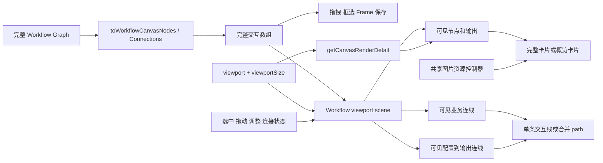

# Workflow 广角渲染能力补齐方案

## 摘要

当前 Workflow 已复用普通 Canvas 的视口变换和图片资源控制器，但没有完整复用低缩放节点简化、视口裁剪和 SVG 路径合并。结果是在 30% 以下仍保留全部完整节点控件、全部输出卡和逐条 SVG；视角提交时还会把 `viewport` 传给每张 Workflow 卡片。

本方案在不改变 Workflow Definition、运行范围、Frame、自动保存和媒体生命周期的前提下，把普通 Canvas 已验证的三项策略接入 Workflow：

1. 只渲染视口附近的逻辑节点、输出卡和连线。
2. 30% 及以下将未选中卡片切换为共享的轻量概览节点。
3. 广角下将非交互业务连线和“配置→输出”连线分别合并为两个 SVG path。

完整 Graph、完整视觉节点数组和完整连接数组继续提供给拖拽、框选、复制、删除、Frame 几何和保存链路。渲染裁剪不写入状态，也不改变运行数据加载的来源判断。

## 当前事实

| 能力 | 普通 Canvas | Workflow |
| --- | --- | --- |
| RAF 视口变换 | `InfiniteCanvas` | 已共用 |
| 图片 LOD、迟滞和四请求并发 | `useCanvasImageResources` | 已共用 |
| 选中图片固定为原图 | `pinnedImageNodeIds` | 仅预览固定，普通选中未接入 |
| 30% 以下轻量节点 | `getCanvasRenderDetail()` + `CanvasNode` overview | 未接入 |
| 视口外节点裁剪 | `visibleNodes` | 仅 Frame 裁剪，节点和输出未裁剪 |
| 视口外连线裁剪 | `visibleConnections` | 未接入 |
| 广角 SVG 合并 | 非交互连线合并为一个 path | 每条业务线和输出线均独立渲染 |

现有 250 个纯文本节点本地短样本在 30% 附近约有 2,786 个 DOM 元素；30 个 Frame 时约 3,090 个。该数据能证明当前渲染规模，不能直接证明完成本方案后的收益。正式收益必须使用相同构建和夹具重新 A/B。

## 目标与边界

### 目标

- 5%、14% 和 30% 缩放下，未选中的 Workflow 卡片只渲染轮廓、媒体或状态占位。
- 31% 以上恢复完整节点内容、工具栏、端口和参数面板。
- 仅挂载视口附近的节点与输出卡；拖动、调整大小、连接和当前选中对象不会因边界变化中途卸载。
- 选中的图片输入和图片输出使用原图优先级，与普通 Canvas 一致。
- 广角下非交互业务连线合并为一个 path；配置到输出的连线因样式不同，合并为另一个 path。
- 选中、切线和正在创建的连线继续单独渲染，保持交互反馈。

### 不在本次范围

- 不修改 Workflow Definition、数据库、API、运行调度、Frame 归属或保存协议。
- 不引入 WebGL、OffscreenCanvas、虚拟 DOM 库或新的状态管理依赖。
- 不修改普通 Canvas 的 30% 阈值、192/256px 图片 LOD 阈值和四请求并发上限。
- 不为了减少渲染而停止 Workflow Run 状态同步，也不丢弃离屏运行结果。
- 不自动提交、推送、部署或重建 Docker。

## 方案选择

| 方案 | 优点 | 风险 | 结论 |
| --- | --- | --- | --- |
| 在 Workflow 内复制普通 Canvas 逻辑 | 初期修改集中 | 阈值、裁剪和视觉会继续漂移 | 不采用 |
| 共享策略和纯几何，Workflow 保留领域适配 | 行为一致，数据模型仍独立 | 需要明确视觉 ID 与逻辑 ID 边界 | 采用 |
| 将编辑器改为 Canvas/WebGL | 极大规模上限更高 | 改写交互、文本和表单，风险远超当前需求 | 当前不采用 |

推荐方案只共享屏幕空间策略、可见性几何和轻量展示。Workflow 的节点类型、输出来源、运行状态、创建和连线规则仍由 Workflow 模块负责。

## 架构



关键约束是：`Workflow viewport scene` 只产生渲染投影，不替换 `canvas.nodes`、`canvas.connections` 或 `graph`。框选、快捷键、删除、复制、Option 拖出和 Frame 扩张仍读取完整数组。

## 一、视口场景与裁剪

新增 `web/src/features/workflows/workflow-viewport-rendering.ts`，集中处理 Workflow 视觉对象的纯计算。

```ts
export type WorkflowOutputLink = CanvasConnection;

export type WorkflowViewportScene = {
    nodeById: ReadonlyMap<string, CanvasNodeData>;
    visibleNodeIds: ReadonlySet<string>;
    visibleConnections: readonly CanvasConnection[];
    visibleOutputLinks: readonly WorkflowOutputLink[];
};

export function workflowOutputLinks(graph: WorkflowGraph): WorkflowOutputLink[];

export function selectWorkflowViewportScene(input: {
    nodes: readonly CanvasNodeData[];
    connections: readonly CanvasConnection[];
    outputLinks: readonly WorkflowOutputLink[];
    viewport: ViewportTransform;
    viewportSize: { width: number; height: number };
    retainedNodeIds: ReadonlySet<string>;
    interactiveConnectionIds: ReadonlySet<string>;
}): WorkflowViewportScene;
```

实现直接复用：

- `isCanvasNodeNearViewport()`；
- `shouldRenderCanvasConnection()`；
- `isCanvasConnectionNearViewport()`；
- `getCanvasViewportBounds()` 的屏幕像素 padding 语义。

`retainedNodeIds` 至少包含：

- 当前选择中的视觉节点；
- 正在拖动和调整大小的视觉节点；
- 正在创建连接的源节点或目标节点；
- 当前切线或选中连线的两个端点。

这能避免节点接近边界时在手势尚未完成前卸载。未显示的节点仍存在于 Graph 和交互数组中，所以框选、全选、删除、复制、运行和保存语义不变。

Workflow Run 详情加载继续使用现有 384px 预取范围。渲染裁剪和运行详情预取不能强制合并成同一个阈值：前者控制 DOM，后者用于让即将进入视口的运行结果提前可用。

## 二、共享概览节点与图片优先级

从普通 `CanvasNode` 的 overview 分支提取共享展示组件 `web/src/components/canvas-overview-node.tsx`：

```ts
export type CanvasOverviewNodeProps = {
    nodeId: string;
    title: string;
    position: Position;
    width: number;
    height: number;
    selected: boolean;
    imageSource?: string;
    imageStorageKey?: string;
    onImageLoaded?: (storageKey: string) => void;
    onMouseDown?: MouseEventHandler<HTMLDivElement>;
    onPointerDown?: PointerEventHandler<HTMLDivElement>;
    onContextMenu?: MouseEventHandler<HTMLDivElement>;
};
```

组件只负责圆角、边框、媒体内容和占位颜色，不包含 Workflow 类型、Store、运行按钮、工具栏或连接规则。普通 Canvas 和 Workflow 分别保留自己的事件入口。

`WorkflowNodeCard` 和 `WorkflowOutputCard` 增加 `renderDetail: CanvasRenderDetail`：

- `overview`：使用共享概览组件，不挂载文本编辑器、配置面板、Ant Design Select、工具栏、调整手柄和连接端口。
- `full`：保持当前结构和行为。
- 图片输入和成功的图片输出显示当前图片资源；视频、配置、文本及等待/失败结果显示克制的类型或状态占位。

缩放判断直接调用 `getCanvasRenderDetail(viewport.k)`。30% 及以下使用 overview，31% 以上使用 full。当前选中节点、正在连接的端点和正在调整大小的节点强制 full；一次只保留少量完整卡片。

图片目标仍通过 `useCanvasImageResources()`。Workflow 增加选择到资源 ID 的映射：

- 选中图片输入：固定 `node.id` 对应资源为原图。
- 选中图片输出：通过当前 `WorkflowOutputExecution.runId + nodeId + slotId` 固定对应资源为原图。
- 配置预览和媒体详情继续沿用现有 pinned/preview 行为。
- 离屏且未固定的资源仍可释放；重新进入视口后由现有控制器恢复。

共享控制器已有 thumbnail/original 竞态、迟到请求和对象 URL 租约测试。Workflow 只新增接线测试，不复制资源控制器实现。

当前 Workflow 卡片把完整 `viewport` 作为 props 传入，主要用于悬停工具栏定位。实施时给 `InfiniteCanvas` 根节点增加稳定的 `data-infinite-canvas` 标记，让已显示的 `WorkflowNodeToolbar` 监听现有 `canvasviewportchange` 事件并重新读取 anchor rect。随后移除所有卡片的 `viewport` props，避免每次视角提交天然改变全部卡片 props。

## 三、SVG 裁剪、缓存与合并

业务连线继续使用 `getConnectionCurve()`；配置到输出的辅助线保留当前固定 48 画布单位控制点，避免视觉形状发生变化。

在图或视觉节点几何变化时构建路径缓存：

```ts
export function workflowConnectionPathCache(
    connections: readonly CanvasConnection[],
    nodeById: ReadonlyMap<string, CanvasNodeData>,
): ReadonlyMap<string, string>;

export function workflowOutputPathCache(
    links: readonly WorkflowOutputLink[],
    nodeById: ReadonlyMap<string, CanvasNodeData>,
): ReadonlyMap<string, string>;
```

视角变化只重新选择可见 ID并拼接缓存字符串，不重新计算全部贝塞尔控制点。

广角渲染规则：

- 非交互业务连线合并为一个 `<path>`，使用当前业务连线样式。
- 配置到输出的辅助线合并为另一个 `<path>`，保留 `.55` 透明度。
- 当前选中、待切割和需要反馈的业务连线继续使用 `ConnectionPath` 单独渲染。
- 正在创建的临时连线继续使用 `ActiveConnectionPath`。
- 31% 以上继续逐条渲染当前可见连线，保持点击命中和悬停体验。

合并 path 不接收鼠标事件，与普通 Canvas 的广角语义一致。用户需要选择或编辑具体连接时，先选择相关节点或放大到完整视图。

## 状态与耦合影响

| 模块 | 影响 | 控制方式 |
| --- | --- | --- |
| Workflow Graph | 无数据变化 | 所有裁剪结果均为派生值 |
| 自动保存与 revision | 无变化 | viewport scene 不进入 document |
| Undo/Redo | 无变化 | overview/full 切换不写历史 |
| Frame | 继续读取完整 Graph | Frame 几何不依赖 DOM 是否挂载 |
| 拖拽与 Option 移出 | 继续读取完整视觉数组 | 手势对象加入 retained 集合 |
| 框选与删除 | 继续读取完整视觉数组 | 不用 visible 数组替换 interactions 输入 |
| Workflow Run | 保留现有可见节点预取 | 离屏详情可卸载，结果索引不丢失 |
| 图片资源 | 共用同一个控制器 | 只补齐选择 pinned 映射 |
| 普通 Canvas | 仅提取 overview 展示 | 原阈值和行为测试必须保持通过 |
| 后端与数据库 | 无修改 | 不执行 Go 迁移或接口变更 |

## 异常与边界

- 视口尺寸为 0 时，只保留 `retainedNodeIds`，不把所有节点错误判为可见。
- 缩放连续跨越 30% 阈值时，图片资源继续使用独立的 192/256px迟滞，不随节点 detail 阈值反复申请 URL。
- 输出 Run 来源变化时，资源 ID 随新的 runId 切换；迟到旧请求不能覆盖新运行资源。
- 正在拖动或调整的节点始终保留 full；手势结束后再由当前缩放决定 detail。
- Frame 标题和边缘命中仍独立渲染；节点裁剪不改变 Frame 可见性与运行按钮。
- 只读状态仍可查看概览和原图预览，不出现编辑端口和调整手柄。

## 验证与验收

### 行为测试

- 5%、14%、30% 返回 overview；31%、100% 返回 full。
- 选中、拖动、调整大小和连接端点在广角下保持 full。
- 视口外节点和输出不进入渲染列表，完整交互数组数量不变。
- 节点跨越视口边缘时不会在拖动中消失。
- 选中图片输入或图片输出后请求 original；取消选择后按屏幕尺寸恢复 thumbnail。
- 原图先完成、旧 thumbnail 后完成时仍显示 original。
- 离屏运行结果返回后不丢失；再次进入视口能显示正确 Run 的结果。
- overview 下非交互业务线和输出线各自合并，交互线保持独立。
- Frame 移动、实时扩大、Option 移出、Undo/Redo 和刷新恢复不受影响。

### 浏览器性能 A/B

使用同一台机器、同一生产构建模式和相同随机种子，准备：

- 250 个混合节点；
- 30 个 Frame；
- 至少 200 条业务连线及生成输出辅助线；
- 图片只使用预置媒体和缓存，不调用生成供应商；
- 5%、14%、30%、31% 和 100% 五个视角。

每组交错执行至少五轮真实鼠标滚轮缩放和空格拖动画布，记录：

- DOM 元素数和挂载的 Workflow 卡片数；
- SVG `<path>` 数量；
- rAF 帧间隔 p50/p95/p99 和最大值；
- React commit 次数与 commit duration；
- Style/Layout/Paint/Composite 时间；
- JS heap、图片元素数、资源请求数和 Object URL 数量。

第一版验收门槛：

- 30% 下未选中节点不包含配置表单、工具栏和连接端口。
- 全部节点都落在广角视口内时，DOM 数量相对当前 250 节点基线至少下降 50%。
- overview 下非交互 SVG path 固定为最多两个，额外 path 只来自选中、切线或临时连接。
- 视口外卡片数量随可见区域变化，不继续等于 Graph 总节点和总输出数。
- 相同 A/B 的五轮中位 p95 不劣于基线，目标改善至少 20%；未达到时保留真实结果并继续用 Performance trace 定位，不能隐藏数据。
- 100% 下行为一致，五轮中位 p95 回退不超过 10%。
- 媒体请求数不因渲染拆分增加，选中图片只产生必要的 original 晋级请求。

### 工程检查

```sh
cd /Users/Admin/codexprogram/infinite-canvas
bun test web/src/features/workflows web/src/app/'(user)'/canvas
cd web
bun run typecheck -- --incremental false
bun run build
cd ..
git diff --check
```

## 停止条件与回滚

出现以下任一情况时停止合并并保留证据：

- 裁剪后的数组进入保存或交互控制器，导致 Graph 内容丢失。
- 离屏节点的运行结果、媒体租约或 Frame 成员被误删除。
- 选中图片造成 original 请求持续重复或超过现有并发策略。
- 30%/31% 来回缩放导致节点位置、连接或工具栏状态改变。
- 100% 正常编辑出现可重复的明显性能回退。

三个能力分别作为独立改动，回滚时按相反顺序撤销 SVG 合并、概览节点、视口裁剪。全部是前端派生渲染逻辑，不需要数据迁移或数据库回滚。
